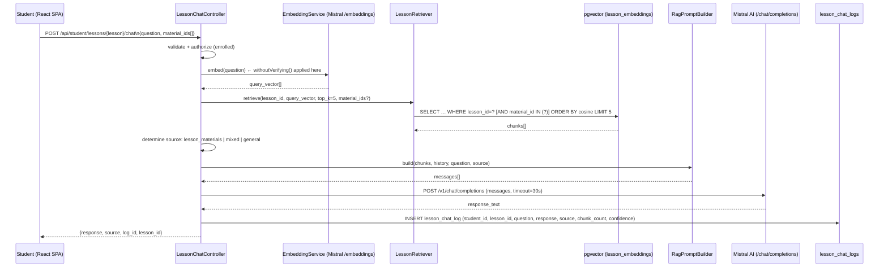
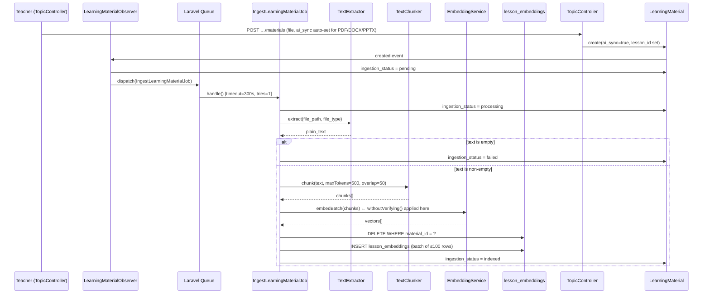

# Design Document: Lesson RAG Chat

## Overview

The Lesson RAG Chat feature adds a retrieval-augmented generation (RAG) chatbot scoped strictly to individual lesson pages. Students interact with a chatbot that answers questions using only the learning materials their teacher has uploaded for that specific lesson, yielding grounded, curriculum-relevant responses.

This is architecturally separate from the existing global chatbot (`ChatbotController` / `chatbot_logs`). The two systems share only the Mistral AI HTTP client and the authenticated user infrastructure — they do not share tables, service classes, conversation history, or retrieval logic.

### Content Hierarchy

```
Subject → Quarter → Topic → Lesson → LearningMaterial
```

A `LearningMaterial` is associated with a lesson via `lesson_id` on the `learning_materials` table. The RAG pipeline retrieves chunks keyed exclusively to that `lesson_id`.

### Key Design Decisions

1. **Three-tier source attribution** (`lesson_materials` / `mixed` / `general`): Rather than a binary fallback, the pipeline explicitly distinguishes the case where lesson context is supplemented with general knowledge.
2. **Student material selection via `material_ids`**: The retriever accepts an optional list of material IDs to scope retrieval, enabling students to focus the AI on specific documents.
3. **SSL bypass on all embedding HTTP calls**: The existing bypass applied only to the chat completion call; it must also apply to the `EmbeddingService` embedding call to prevent silent failures on Windows local dev.
4. **Job timeout extended to 300 seconds (5 minutes)**: Large PPTX/DOCX files can exceed the current 120-second limit; the job catches the timeout and marks the material `failed`.
5. **Empty-text guard in the ingest job**: If `TextExtractor` returns an empty string, the job sets `ingestion_status = failed` rather than inserting zero chunks and marking `indexed`.

---

## Architecture

### High-Level Component Map

```
┌─────────────────────────────────────────────────────────────────────────┐
│  React SPA (TypeScript / Vite)                                          │
│                                                                         │
│  ┌──────────────────┐        ┌───────────────────────────────────┐      │
│  │   SourcePanel     │◄──────►│          ChatPanel                │      │
│  │  (left column)    │  shared│  (message thread + input bar)     │      │
│  │                   │  state │                                   │      │
│  │ • checkboxes       │        │ • message list                    │      │
│  │ • status badges    │        │ • source badge per message        │      │
│  │ • count badge      │        │ • header: "Using N sources"       │      │
│  │ • polling (≤30s)   │        │ • input + send button             │      │
│  └────────┬─────────┘        └──────────────┬────────────────────┘      │
│           │ selectedMaterialIds[]            │ POST with material_ids    │
└───────────┼─────────────────────────────────┼───────────────────────────┘
            │                                 │
            │  GET /api/student/classes/…/    │  POST /api/student/lessons/{lesson}/chat
            │  topics/…/lessons/…/materials   │  {question, material_ids[]}
            ▼                                 ▼
┌─────────────────────────────────────────────────────────────────────────┐
│  Laravel 10 Backend (PHP 8.2)                                           │
│                                                                         │
│  TopicController                LessonChatController                    │
│  (GET materials + status)       (POST chat ask)                         │
│         │                              │                                │
│         │                    ┌─────────┴──────────┐                    │
│         │                    ▼                    ▼                     │
│         │           EmbeddingService       LessonRetriever              │
│         │           (embed question)       (pgvector similarity)        │
│         │                    │                    │                     │
│         │                    └─────────┬──────────┘                    │
│         │                             ▼                                 │
│         │                    RagPromptBuilder                           │
│         │                    (assemble messages)                        │
│         │                             │                                 │
│         │                             ▼                                 │
│         │                    Mistral AI API                             │
│         │                    (chat completions)                         │
│         │                             │                                 │
│         │                             ▼                                 │
│         │                    lesson_chat_logs (DB)                      │
│         │                                                               │
│  LearningMaterialObserver ──► IngestLearningMaterialJob                 │
│                                   │                                     │
│                          TextExtractor → TextChunker → EmbeddingService │
│                                                              │          │
│                                                    lesson_embeddings    │
│                                                    (pgvector table)     │
└─────────────────────────────────────────────────────────────────────────┘
```

### Chat Request Flow (Sequence)



### Ingestion Flow (Sequence)



### Component Responsibilities

| Component | Responsibility |
|---|---|
| `LessonChatController` | HTTP layer — validate, authorize, orchestrate chat pipeline |
| `LessonChatLogController` (Teacher) | Paginated teacher-facing log retrieval |
| `LessonChatController` (Student log endpoint) | Student's own chat history for a lesson |
| `LessonRetriever` | pgvector similarity search scoped to lesson + optional material_ids |
| `EmbeddingService` | Wrap Mistral `/v1/embeddings` endpoint; apply SSL bypass |
| `RagPromptBuilder` | Assemble Mistral messages with correct system prompt per source tier |
| `IngestLearningMaterialJob` | Extract → empty-text guard → chunk → embed → upsert; timeout=300s |
| `TextExtractor` | Delegate to file-type-specific parsers (PDF/DOCX/PPTX) |
| `TextChunker` | Split text into overlapping fixed-size chunks |
| `LearningMaterialObserver` | Trigger ingestion and cleanup on model lifecycle events |

---

## Components and Interfaces

### 1. `EmbeddingService` (Modified — SSL Fix)

**File:** `app/Services/Rag/EmbeddingService.php`

The current implementation calls `Http::timeout(30)->withToken(...)->post(...)` with no SSL bypass. On Windows local dev environments, this causes silent failures. The fix applies `->withoutVerifying()` to the embedding call, mirroring the existing bypass on the chat completion call.

```php
public function embedBatch(array $texts): array
{
    $response = Http::timeout(30)
        ->withToken(config('services.mistral.api_key'))
        ->withoutVerifying()   // ← ADD: matches SSL bypass on chat completion calls
        ->post(self::API_URL, [
            'model' => config('services.mistral.embedding_model', 'mistral-embed'),
            'input' => $texts,
        ]);

    if ($response->failed()) {
        throw new EmbeddingException(
            'Mistral embedding API error: HTTP ' . $response->status()
        );
    }
    // ... rest unchanged
}
```

The model name is moved to `config('services.mistral.embedding_model', 'mistral-embed')` so it can be overridden in `.env` without code changes.

---

### 2. `LessonRetriever` (Modified — `material_ids` Scoping)

**File:** `app/Services/Rag/LessonRetriever.php`

Add an optional `materialIds` parameter. When non-empty, add a `material_id IN (…)` clause to the SQL query. `material_id` values that do not belong to the requested `lesson_id` are silently ignored because the `lesson_id = ?` clause already filters them out.

```php
class LessonRetriever
{
    /**
     * @param  int        $lessonId     Scope retrieval to this lesson
     * @param  float[]    $queryVector  Embedded question vector
     * @param  int        $topK         Max chunks to return (default 5)
     * @param  int[]      $materialIds  Optional: restrict to these material IDs
     * @return Collection               Objects with: id, material_id, chunk_index, chunk_text, score
     */
    public function retrieve(
        int   $lessonId,
        array $queryVector,
        int   $topK = 5,
        array $materialIds = []
    ): Collection {
        $vectorLiteral = '[' . implode(',', $queryVector) . ']';

        $materialFilter = '';
        $bindings       = [$vectorLiteral, $lessonId, $vectorLiteral, $vectorLiteral, $topK];

        if (!empty($materialIds)) {
            $placeholders   = implode(',', array_fill(0, count($materialIds), '?'));
            $materialFilter = "AND material_id IN ({$placeholders})";
            // Inject material IDs before the LIMIT binding
            array_splice($bindings, 4, 0, $materialIds);
        }

        $rows = DB::select(
            "SELECT id, lesson_id, material_id, chunk_index, chunk_text,
                    1 - (embedding <=> ?) AS score
             FROM lesson_embeddings
             WHERE lesson_id = ?
               AND 1 - (embedding <=> ?) >= 0.5
               {$materialFilter}
             ORDER BY embedding <=> ? ASC, id ASC
             LIMIT ?",
            $bindings
        );

        return collect($rows);
    }
}
```

---

### 3. `LessonChatController` (Modified — `material_ids` + `mixed` source + student log endpoint)

**File:** `app/Http/Controllers/Api/Student/LessonChatController.php`

**Changes:**
- Accept `material_ids` in the request body and pass it to `LessonRetriever::retrieve()`.
- Introduce a `"mixed"` source tier and `confidence_score = 80` alongside the existing `"lesson_materials"` (90) and `"general"` (70) tiers.
- Add a `logs()` method for the student's own chat history endpoint.

The `mixed` source is triggered by a business-logic decision made in the controller based on a "low coverage" signal. For this implementation, low coverage is defined as: chunks were found (score ≥ 0.5) but fewer than 2 chunks were retrieved (the material only partially covers the topic). This threshold is intentionally simple and configurable.

```php
class LessonChatController extends Controller
{
    public function __construct(
        private readonly EmbeddingService $embeddingService,
        private readonly LessonRetriever  $retriever,
        private readonly RagPromptBuilder $promptBuilder,
    ) {}

    public function ask(Request $request, Lesson $lesson): JsonResponse
    {
        $validated = $request->validate([
            'question'     => 'required|string|max:2000',
            'material_ids' => 'sometimes|array|max:50',
            'material_ids.*' => 'integer',
        ]);

        $student = $request->user();

        $isEnrolled = $lesson->topic->schoolClass->students()
            ->where('users.id', $student->id)
            ->exists();

        if (!$isEnrolled) {
            return response()->json(
                ['error' => 'You are not enrolled in the class for this lesson.'],
                403
            );
        }

        $question    = $validated['question'];
        $materialIds = $validated['material_ids'] ?? [];

        // 1. Embed the student's question (SSL bypass applied inside EmbeddingService)
        try {
            $queryVector = $this->embeddingService->embed($question);
        } catch (EmbeddingException $e) {
            Log::error('LessonChat embedding failed', ['lesson_id' => $lesson->id, 'error' => $e->getMessage()]);
            return response()->json(['error' => 'AI service temporarily unavailable. Please try again.'], 502);
        }

        // 2. Retrieve relevant chunks (scoped to lesson + optional material selection)
        $chunks = $this->retriever->retrieve($lesson->id, $queryVector, 5, $materialIds);

        // 3. Determine source tier
        //    lesson_materials: ≥2 high-quality chunks found → answer from materials only
        //    mixed:            1 chunk found (partial coverage) → supplement with general knowledge
        //    general:          0 chunks found → answer from general knowledge only
        $chunkCount = $chunks->count();
        if ($chunkCount >= 2) {
            $source          = 'lesson_materials';
            $confidenceScore = 90;
        } elseif ($chunkCount === 1) {
            $source          = 'mixed';
            $confidenceScore = 80;
        } else {
            $source          = 'general';
            $confidenceScore = 70;
        }

        // 4. Fetch last 5 chat log entries for conversation history (ASC order for Mistral)
        $history = LessonChatLog::where('student_id', $student->id)
            ->where('lesson_id', $lesson->id)
            ->orderBy('created_at', 'asc')
            ->take(5)
            ->get();

        // 5. Build the Mistral messages array (system prompt varies by source tier)
        $messages = $this->promptBuilder->build($chunks, $history, $question, $source);

        // 6. Call Mistral AI chat completions
        $apiKey = config('services.mistral.api_key');
        $model  = config('services.mistral.model', 'mistral-small-latest');

        try {
            $mistralResponse = Http::withHeaders([
                'Authorization' => "Bearer {$apiKey}",
                'Content-Type'  => 'application/json',
            ])->timeout(30)
              ->withoutVerifying()
              ->post('https://api.mistral.ai/v1/chat/completions', [
                'model'       => $model,
                'messages'    => $messages,
                'max_tokens'  => 600,
                'temperature' => 0.7,
            ]);

            if ($mistralResponse->failed()) {
                Log::error('LessonChat Mistral API error', ['status' => $mistralResponse->status(), 'lesson_id' => $lesson->id]);
                return response()->json(['error' => 'AI service temporarily unavailable. Please try again.'], 502);
            }
        } catch (\Illuminate\Http\Client\ConnectionException $e) {
            Log::error('LessonChat Mistral timeout', ['lesson_id' => $lesson->id, 'error' => $e->getMessage()]);
            return response()->json(['error' => 'AI service temporarily unavailable. Please try again.'], 502);
        }

        $responseText = $mistralResponse->json('choices.0.message.content')
            ?? 'Sorry, I could not generate a response. Please try again.';

        // 7. Persist chat log (silently catches storage errors per Requirement 5.1)
        try {
            $log = LessonChatLog::create([
                'student_id'            => $student->id,
                'lesson_id'             => $lesson->id,
                'question'              => $question,
                'response'              => $responseText,
                'source'                => $source,
                'retrieved_chunk_count' => $chunkCount,
                'confidence_score'      => $confidenceScore,
            ]);
            $logId = $log->id;
        } catch (\Throwable $e) {
            Log::error('LessonChat log persist failed', ['lesson_id' => $lesson->id, 'error' => $e->getMessage()]);
            $logId = null;
        }

        return response()->json([
            'response'  => $responseText,
            'source'    => $source,
            'log_id'    => $logId,
            'lesson_id' => $lesson->id,
        ]);
    }

    /**
     * GET /api/student/lessons/{lesson}/chat-logs
     * Returns the authenticated student's own chat history for this lesson.
     */
    public function logs(Request $request, Lesson $lesson): JsonResponse
    {
        $student = $request->user();

        $isEnrolled = $lesson->topic->schoolClass->students()
            ->where('users.id', $student->id)
            ->exists();

        if (!$isEnrolled) {
            return response()->json(['error' => 'You are not enrolled in the class for this lesson.'], 403);
        }

        $logs = LessonChatLog::where('student_id', $student->id)
            ->where('lesson_id', $lesson->id)
            ->orderBy('created_at', 'desc')
            ->paginate(20);

        return response()->json($logs);
    }
}
```

---

### 4. `RagPromptBuilder` (Modified — `mixed` source tier + `source` parameter)

**File:** `app/Services/Rag/RagPromptBuilder.php`

Add a `$source` parameter to `build()` so the caller explicitly controls which system prompt variant is used. This avoids re-deriving the source from the chunk count inside the builder.

```php
class RagPromptBuilder
{
    /**
     * @param  Collection  $chunks   Retrieved lesson embedding chunks
     * @param  Collection  $history  Recent LessonChatLog records
     * @param  string      $question The student's current question
     * @param  string      $source   One of: 'lesson_materials' | 'mixed' | 'general'
     * @return array       Full messages array: [system, ...history pairs, user]
     */
    public function build(
        Collection $chunks,
        Collection $history,
        string     $question,
        string     $source = 'general'
    ): array {
        $systemContent = $this->buildSystemPrompt($chunks, $source);

        $messages = [['role' => 'system', 'content' => $systemContent]];

        foreach ($history->sortBy('created_at')->take(5) as $log) {
            $messages[] = ['role' => 'user',      'content' => $log->question];
            $messages[] = ['role' => 'assistant', 'content' => $log->response];
        }

        $messages[] = ['role' => 'user', 'content' => $question];

        return $messages;
    }

    private function buildSystemPrompt(Collection $chunks, string $source): string
    {
        $base = "You are a helpful lesson assistant for a Filipino student on the LearnShift platform. "
              . "Be concise, friendly, and educational.";

        if ($source === 'general' || $chunks->isEmpty()) {
            return $base . "\n\n"
                 . "No indexed lesson materials are available for this lesson. "
                 . "Answer the student's question using your general knowledge.";
        }

        $context = $chunks->map(fn($chunk) => $chunk->chunk_text)->implode("\n\n---\n\n");

        if ($source === 'lesson_materials') {
            return $base . "\n\n"
                 . "Answer the student's question using ONLY the lesson materials provided below. "
                 . "Do not use information outside these materials.\n\n"
                 . "=== LESSON MATERIALS ===\n\n" . $context . "\n\n========================";
        }

        // source === 'mixed': use lesson context first, supplement with general knowledge
        return $base . "\n\n"
             . "Answer the student's question using the lesson materials below as your primary source. "
             . "Where the materials are insufficient, supplement your answer with your general knowledge.\n\n"
             . "=== LESSON MATERIALS ===\n\n" . $context . "\n\n========================";
    }
}
```

---

### 5. `IngestLearningMaterialJob` (Modified — empty-text guard + 5-minute timeout)

**File:** `app/Jobs/IngestLearningMaterialJob.php`

Two changes:
1. `$timeout` raised from 120 to 300 (5 minutes) per Requirement 2.10.
2. Empty-text guard after extraction: if `$text` is empty after trimming, set `ingestion_status = failed` and return early per Requirement 2.3.

```php
class IngestLearningMaterialJob implements ShouldQueue
{
    use Queueable;

    public int $tries   = 1;
    public int $timeout = 300;  // ← Changed from 120 to 300 (5 minutes)

    public function __construct(private readonly int $materialId) {}

    public function handle(
        TextExtractor  $extractor,
        TextChunker    $chunker,
        EmbeddingService $embedder
    ): void {
        $material = LearningMaterial::findOrFail($this->materialId);

        try {
            $material->update(['ingestion_status' => 'processing']);

            $filePath = Storage::path($material->file_path);
            $text     = $extractor->extract($filePath, $material->file_type);

            // ← ADD: empty-text guard (Requirement 2.3)
            if (trim($text) === '') {
                Log::warning('IngestLearningMaterialJob: extracted text is empty', [
                    'material_id' => $this->materialId,
                ]);
                $material->update(['ingestion_status' => 'failed']);
                return;
            }

            $chunks  = $chunker->chunk($text);
            $vectors = $embedder->embedBatch($chunks);

            LessonEmbedding::where('material_id', $this->materialId)->delete();

            $now  = now()->toDateTimeString();
            $rows = [];

            foreach ($chunks as $index => $chunkText) {
                $rows[] = [
                    'lesson_id'   => $material->lesson_id,
                    'material_id' => $this->materialId,
                    'chunk_index' => $index,
                    'chunk_text'  => $chunkText,
                    'embedding'   => '[' . implode(',', $vectors[$index]) . ']',
                    'created_at'  => $now,
                ];
            }

            foreach (array_chunk($rows, 100) as $batch) {
                DB::table('lesson_embeddings')->insert($batch);
            }

            $material->update(['ingestion_status' => 'indexed']);

        } catch (\Throwable $e) {
            Log::error('IngestLearningMaterialJob failed', [
                'material_id' => $this->materialId,
                'error'       => $e->getMessage(),
                'trace'       => $e->getTraceAsString(),
            ]);
            $material->update(['ingestion_status' => 'failed']);
            // Do NOT rethrow — prevents queue retry; failure surfaced via ingestion_status
        }
    }
}
```

---

### 6. `LearningMaterialObserver` (No Changes Required)

**File:** `app/Observers/LearningMaterialObserver.php`

The existing observer already handles all required trigger conditions (Requirement 2.1, 2.7, 2.8):
- `created`: ai_sync=true + lesson_id → dispatch job
- `updated`: ai_sync false→true OR file_path changed with ai_sync=true → dispatch job
- `updated`: ai_sync true→false → delete embeddings, set status=none
- `deleted`: delete all embeddings for material_id

No changes required to this file.

---

### 7. `LessonChatLogController` (Teacher, No Changes Required)

**File:** `app/Http/Controllers/Api/Teacher/LessonChatLogController.php`

The existing implementation already satisfies Requirement 5.5 and 5.6. No changes required.

---

### 8. New Route: Student Chat Logs

**File:** `routes/api.php`

Add the student chat log route inside the `student` prefix group:

```php
Route::get('lessons/{lesson}/chat-logs', [LessonChatController::class, 'logs']);
```

---

## Data Models

### Existing Table: `lesson_embeddings` (No Migration Needed)

Already created by `2026_06_15_000002_create_lesson_embeddings_table.php`. Current schema:

```sql
lesson_embeddings (
    id            BIGSERIAL PRIMARY KEY,
    lesson_id     BIGINT NOT NULL REFERENCES lessons(id) ON DELETE CASCADE,
    material_id   BIGINT NOT NULL REFERENCES learning_materials(id) ON DELETE CASCADE,
    chunk_index   INTEGER NOT NULL,
    chunk_text    TEXT NOT NULL,
    embedding     VECTOR(1024) NOT NULL,
    created_at    TIMESTAMP NOT NULL DEFAULT NOW()
)
-- Indexes: idx_lesson_embeddings_lesson_id, idx_lesson_embeddings_material_id
-- IVFFlat ANN index: idx_lesson_embeddings_ivfflat (embedding vector_cosine_ops, lists=100)
```

No new migration needed. The existing schema supports all required query patterns including the new `material_id IN (…)` filter.

### Existing Table: `learning_materials` (No Migration Needed)

Already has `lesson_id` (from `add_lesson_id_to_learning_materials`) and `ingestion_status` (from `add_ingestion_status_to_learning_materials`). The `ingestion_status` enum already includes `none`, `pending`, `processing`, `indexed`, `failed`.

### Existing Table: `lesson_chat_logs` (No Migration Needed)

Already created by `2026_06_14_150002_create_lesson_chat_logs_table.php`. The existing `source VARCHAR(30)` column already accommodates the new `"mixed"` value (within 30 characters). No migration needed.

### Migration Required: `update_lesson_chat_logs_confidence_score_range`

The `confidence_score` column is `unsignedTinyInteger` (0–255), which already accommodates 70, 80, and 90. **No migration needed** for the schema itself.

However, a **new migration is needed** to update the `source` check constraint if one was added as a DB-level constraint. Checking the existing migration — `source` is stored as `string(30)` with no enum constraint, so no migration is needed.

**Summary: No new database migrations are required.** All existing tables and columns accommodate the feature as designed.

### Eloquent Model Updates

**`LearningMaterial`** — ensure `ingestion_status` and `lesson_id` are in `$fillable` (already present via existing code).

**`LessonChatLog`** — no changes needed; `source` field already stores string values.

**`LessonEmbedding`** — no changes needed.

**`Lesson`** — already has `learningMaterials()` and `topic()` relationships.

---

## API Contract

### POST `/api/student/lessons/{lesson}/chat`

**Auth:** Sanctum (`auth:sanctum`), student role. Student must be enrolled in the lesson's class.

**Request Body:**

```json
{
  "question": "What is photosynthesis?",
  "material_ids": [12, 15]
}
```

| Field | Type | Required | Constraints |
|---|---|---|---|
| `question` | string | Yes | max 2000 characters |
| `material_ids` | integer[] | No | max 50 elements; each element must be an integer; non-existent or cross-lesson IDs are silently ignored |

**Success Response (200):**

```json
{
  "response": "Photosynthesis is the process by which...",
  "source": "lesson_materials",
  "log_id": 42,
  "lesson_id": 7
}
```

| Field | Type | Values |
|---|---|---|
| `response` | string | Non-empty AI-generated answer |
| `source` | string | `"lesson_materials"` \| `"mixed"` \| `"general"` |
| `log_id` | integer \| null | ID of the persisted `LessonChatLog`; null if DB persist failed |
| `lesson_id` | integer | The lesson ID from the route parameter |

**Error Responses:**

| HTTP | Condition |
|---|---|
| 401 | Unauthenticated request |
| 403 | Non-student role or student not enrolled in the lesson's class |
| 404 | Lesson not found |
| 422 | `question` exceeds 2000 chars, is missing, or `material_ids` contains non-integers |
| 502 | Mistral AI error or timeout; EmbeddingService error |

---

### GET `/api/student/lessons/{lesson}/chat-logs`

**Auth:** Sanctum, student role. Student must be enrolled in the lesson's class; returns only the authenticated student's own logs.

**Query Parameters:** Standard Laravel pagination (`page`).

**Success Response (200):** Paginated Laravel response.

```json
{
  "data": [
    {
      "id": 42,
      "student_id": 5,
      "lesson_id": 7,
      "question": "What is photosynthesis?",
      "response": "Photosynthesis is...",
      "source": "lesson_materials",
      "retrieved_chunk_count": 3,
      "confidence_score": 90,
      "created_at": "2026-06-20T10:30:00.000000Z"
    }
  ],
  "current_page": 1,
  "per_page": 20,
  "total": 5,
  "last_page": 1
}
```

**Error Responses:**

| HTTP | Condition |
|---|---|
| 401 | Unauthenticated |
| 403 | Student not enrolled, or student requesting another student's logs (handled by scoping query to authenticated student ID) |
| 404 | Lesson not found |

---

### GET `/api/teacher/lessons/{lesson}/chat-logs`

**Auth:** Sanctum. Teacher must be the assigned teacher for the class containing the lesson.

**Query Parameters:** Standard Laravel pagination (`page`).

**Success Response (200):** Paginated response, sorted by `created_at` DESC, 20 per page.

```json
{
  "data": [
    {
      "id": 42,
      "student_id": 5,
      "question": "What is photosynthesis?",
      "response": "Photosynthesis is...",
      "source": "lesson_materials",
      "retrieved_chunk_count": 3,
      "confidence_score": 90,
      "created_at": "2026-06-20T10:30:00.000000Z"
    }
  ],
  "current_page": 1,
  "per_page": 20,
  "total": 12,
  "last_page": 1
}
```

**Error Responses:**

| HTTP | Condition |
|---|---|
| 401 | Unauthenticated |
| 403 | Teacher is not the assigned teacher for the lesson's class |
| 404 | Lesson not found |

---

### GET `/api/teacher/classes/{classId}/topics/{topicId}/lessons/{lessonId}/materials`

Existing endpoint. Now must include `ingestion_status` in each material item.

**Success Response (200):**

```json
{
  "materials": [
    {
      "id": 12,
      "title": "Chapter 1 Notes",
      "file_name": "chapter1.pdf",
      "file_type": "PDF",
      "file_size": 204800,
      "ai_sync": true,
      "ingestion_status": "indexed",
      "file_url": "https://…/storage/lessons/7/materials/chapter1.pdf",
      "created_at": "2026-06-18T09:00:00.000000Z"
    }
  ],
  "links": []
}
```

The `ingestion_status` field is already included via `$material->toArray()` since it is in `$fillable`. No code changes needed.

---

## Frontend Component Design

### State Architecture

The lesson page maintains shared state between `SourcePanel` and `ChatPanel` using a parent component (or a dedicated React context/hook — `useLessonChat`):

```typescript
interface Material {
  id: number;
  title: string;
  file_name: string;
  file_type: string;
  ai_sync: boolean;
  ingestion_status: 'none' | 'pending' | 'processing' | 'indexed' | 'failed';
}

interface LessonChatState {
  materials: Material[];
  selectedMaterialIds: Set<number>;    // only indexed materials can be selected
  isLoadingMaterials: boolean;
}
```

### SourcePanel Component

**File:** `src/components/lesson/SourcePanel.tsx` (new or updated)

**Responsibilities:**
- Fetch and display all `LearningMaterial` records for the current lesson.
- Poll the materials endpoint every 30 seconds to refresh `ingestion_status`.
- Render each material with a checkbox and status indicator.
- Maintain `selectedMaterialIds` state, propagating changes to `ChatPanel` via the shared state.
- Show a count badge and fallback "Using all sources" text.

**Visual Spec:**

```
┌─────────────────────────────────────┐
│ Sources  [2 of 3 selected]          │
├─────────────────────────────────────┤
│ ☑  ● Chapter 1 Notes.pdf            │  ← green dot = indexed, checkbox enabled
│ ☑  ● Chapter 2 Slides.pptx          │  ← green dot = indexed, checkbox enabled
│ ☐  ◌ Assignment Sheet.docx          │  ← pulsing dot = processing, checkbox disabled
│     ⚠ Broken File.pptx              │  ← warning icon = failed, checkbox disabled
└─────────────────────────────────────┘
│ "Using all sources" shown when      │
│ selectedMaterialIds is empty        │
└─────────────────────────────────────┘
```

**Component Interface:**

```typescript
interface SourcePanelProps {
  lessonId: number;
  classId: number;
  topicId: number;
  selectedMaterialIds: Set<number>;
  onSelectionChange: (ids: Set<number>) => void;
  onMaterialsLoaded: (materials: Material[]) => void;
}
```

**Status Indicator Logic:**

| `ingestion_status` | Indicator | Checkbox |
|---|---|---|
| `indexed` | Green filled circle | Enabled |
| `pending` / `processing` | Pulsing gray circle (CSS `animate-pulse`) | Disabled |
| `failed` / `none` | Yellow warning triangle (⚠) | Disabled |

**Count Badge:**
- Numerator: count of selected material IDs where `ingestion_status === 'indexed'`
- Denominator: count of all materials where `ingestion_status === 'indexed'`
- Format: `"N of M selected"` or `"Using all sources"` when N = 0

**Polling:**

```typescript
useEffect(() => {
  const fetchMaterials = async () => { /* GET …/materials */ };
  fetchMaterials();                          // immediate on mount
  const interval = setInterval(fetchMaterials, 30_000);
  return () => clearInterval(interval);
}, [lessonId]);
```

**Auto-deselect on status change (Requirement 7.13):**

```typescript
useEffect(() => {
  // Remove from selection any material that is no longer indexed
  const indexedIds = new Set(materials.filter(m => m.ingestion_status === 'indexed').map(m => m.id));
  const pruned = new Set([...selectedMaterialIds].filter(id => indexedIds.has(id)));
  if (pruned.size !== selectedMaterialIds.size) {
    onSelectionChange(pruned);
  }
}, [materials]);
```

---

### ChatPanel Component

**File:** `src/components/lesson/ChatPanel.tsx` (new or updated)

**Responsibilities:**
- Render the message thread with per-message source badges.
- Show a persistent header indicator of the current source context.
- Send POST requests to the lesson chat endpoint, including `material_ids`.
- Update the header indicator within 500ms of selection changes (achieved reactively via props).

**Component Interface:**

```typescript
interface ChatPanelProps {
  lessonId: number;
  selectedMaterialIds: Set<number>;   // from SourcePanel shared state
}
```

**Source Badge Logic:**

```typescript
const SourceBadge = ({ source }: { source: string | null }) => {
  switch (source) {
    case 'lesson_materials':
      return <span className="badge badge-green">Lesson Material</span>;
    case 'mixed':
      return <span className="badge badge-blue">Mixed Sources</span>;
    case 'general':
      return <span className="badge badge-gray">General Knowledge</span>;
    default:
      return <span className="badge badge-gray">Unknown Source</span>;
  }
};
```

**Header Indicator (Requirement 9.4):**

```typescript
const sourceContextLabel = selectedMaterialIds.size > 0
  ? `Using ${selectedMaterialIds.size} source${selectedMaterialIds.size > 1 ? 's' : ''}`
  : 'Using all sources';
```

**Chat Request:**

```typescript
const sendMessage = async (question: string) => {
  const body: Record<string, unknown> = { question };
  if (selectedMaterialIds.size > 0) {
    body.material_ids = [...selectedMaterialIds];
  }
  const response = await api.post(`/student/lessons/${lessonId}/chat`, body);
  // Append message + source badge to thread
};
```

**Message Model:**

```typescript
interface ChatMessage {
  role: 'user' | 'assistant';
  content: string;
  source?: 'lesson_materials' | 'mixed' | 'general' | null;
  log_id?: number | null;
}
```

---

## Correctness Properties

*A property is a characteristic or behavior that should hold true across all valid executions of a system — essentially, a formal statement about what the system should do. Properties serve as the bridge between human-readable specifications and machine-verifiable correctness guarantees.*

### Property 1: Lesson-Scoped Retrieval Isolation

*For any* lesson ID `L` and any vector store seeded with chunks belonging to multiple distinct lesson IDs (including `L`), querying the retriever with lesson ID `L` shall return only chunks whose `lesson_id` equals `L`, and the returned set shall contain at most 5 chunks.

**Validates: Requirements 1.1, 1.4**

---

### Property 2: Retrieved Chunks Appear in System Prompt

*For any* non-empty list of retrieved chunks and source tier `"lesson_materials"` or `"mixed"`, the system prompt constructed by `RagPromptBuilder::build()` shall contain the exact text of every chunk in the input list.

**Validates: Requirements 1.2, 3.1, 3.2**

---

### Property 3: Chunker Size and Overlap Invariants

*For any* non-empty input text of arbitrary length, the array of chunks produced by `TextChunker::chunk(text, maxTokens=500, overlap=50)` shall satisfy: every chunk contains at most 500 × 4 = 2000 characters, and for every pair of consecutive chunks `i` and `i+1`, the last N characters of chunk `i` (up to the overlap size) equal the first N characters of chunk `i+1`.

**Validates: Requirements 2.3**

---

### Property 4: Embedding Count Matches Chunk Count

*For any* array of N text chunks (N ≥ 1) passed to `EmbeddingService::embedBatch()`, the returned array of vectors shall have exactly N elements in the same order as the input.

**Validates: Requirements 2.4**

---

### Property 5: Upsert Replaces Prior Embeddings

*For any* `material_id` that already has one or more rows in `lesson_embeddings`, after `IngestLearningMaterialJob` completes successfully with a new non-empty set of chunks, the vector store shall contain exactly the new chunks for that `material_id` (same count as the new chunk array) and zero rows from the previous chunk set.

**Validates: Requirements 2.5**

---

### Property 6: Material Deletion Removes All Embeddings

*For any* `material_id` with one or more rows in `lesson_embeddings`, after the corresponding `LearningMaterial` is deleted, the count of `lesson_embeddings` rows with that `material_id` shall be exactly 0.

**Validates: Requirements 2.7**

---

### Property 7: Source Field Assignment by Similarity Threshold

*For any* retrieval result set: if the set is empty (no chunks with score ≥ 0.5), the controller shall assign `source = "general"`. If the set contains exactly 1 chunk, the controller shall assign `source = "mixed"`. If the set contains 2 or more chunks, the controller shall assign `source = "lesson_materials"`.

**Validates: Requirements 3.3, 3.4, 3.5, 8.1, 8.2, 8.3**

---

### Property 8: Conversation History Window and Order

*For any* student + lesson combination with N existing `LessonChatLog` records, the messages array assembled for the Mistral API shall include exactly `min(N, 5)` prior log pairs, each pair ordered by `created_at` ascending, and the current question shall be the final user message.

**Validates: Requirements 3.6**

---

### Property 9: Question Length Validation Boundary

*For any* string of length > 2000 characters submitted as `question`, the endpoint shall return HTTP 422. *For any* string of length 1–2000 characters, the endpoint shall not return HTTP 422 due to length.

**Validates: Requirements 3.8, 4.1**

---

### Property 10: Response Payload Completeness

*For any* valid lesson chat request that produces a successful Mistral AI response (mocked), the JSON response body shall contain the fields `response` (non-empty string), `source` (one of `"lesson_materials"`, `"mixed"`, or `"general"`), `log_id` (integer or null), and `lesson_id` (integer matching the route parameter).

**Validates: Requirements 4.4**

---

### Property 11: Material ID Scoping Narrows Retrieval

*For any* lesson with M indexed materials and a non-empty `material_ids` list containing a strict subset of those material IDs, all chunks returned by the retriever shall have a `material_id` that is in the provided list. Chunk IDs belonging to materials outside the list shall never appear in the result.

**Validates: Requirements 4.7, 4.8**

---

### Property 12: Chat Log Persistence with All Required Fields

*For any* successful lesson chat interaction (mocked Mistral AI), a `LessonChatLog` record shall be persisted in the database containing non-null values for `student_id`, `lesson_id`, `question`, `response`, `source`, `retrieved_chunk_count`, and `confidence_score`.

**Validates: Requirements 5.1**

---

### Property 13: Teacher Materials List Includes `ingestion_status`

*For any* list of `LearningMaterial` records returned by the teacher lesson-materials endpoint, every item in the response payload shall include an `ingestion_status` field with a value from `{none, pending, processing, indexed, failed}`.

**Validates: Requirements 6.7**

---

### Property 14: Embedding Determinism

*For any* chunk text, embedding it twice using the same configured model version shall yield two vectors whose cosine similarity equals 1.0 (identical vectors), meaning the embedding function is pure and deterministic for the same model version.

**Validates: Requirements 11.1, 11.4**

---

### Property 15: Retrieval Determinism and Tie-Breaking

*For any* query vector and unchanged vector store state, submitting the same query twice shall return the same ordered list of chunk IDs. When two chunks have equal cosine similarity scores, the one with the lower `id` shall appear first.

**Validates: Requirements 11.3, 11.5**

---

### Redundancy Analysis

After reflection:
- 1.1 and 1.4 → unified into Property 1 (isolation + top-5 limit)
- 1.2, 3.1, 3.2 → unified into Property 2 (prompt contains all chunks)
- 3.3, 3.4, 3.5, 8.1, 8.2, 8.3 → unified into Property 7 (three-tier source assignment rule)
- 11.3 and 11.5 → unified into Property 15 (determinism subsumes tie-breaking)
- 11.1 and 11.4 → unified into Property 14 (determinism covers both)
- 5.2, 5.3, 5.4 (confidence score mapping) → constant rules tested as examples, not properties
- 2.1 (observer trigger conditions) → three discrete trigger scenarios, tested as examples

15 properties remain, each providing unique validation value.

---

## Error Handling

### Mistral AI Errors

Both `EmbeddingService::embedBatch()` and `LessonChatController::ask()` handle Mistral errors:

**Embedding failure** (EmbeddingException) → caught in controller → HTTP 502 returned before querying the vector store (Requirement 1.5).

**Chat completion failure** (non-2xx or timeout) → caught in controller → HTTP 502 returned.

Neither error causes a log record to be persisted (the log write happens after a successful AI response).

### Ingestion Job Errors

The entire `handle()` body is wrapped in `try/catch (\Throwable)`. All failures set `ingestion_status = failed` and log the error. The job does not rethrow, preventing queue retries and silent failure loops. The `$tries = 1` setting is unchanged. Teachers observe `ingestion_status = failed` in the materials list and can re-trigger ingestion by toggling `ai_sync`.

### Empty Text Extraction

If `TextExtractor::extract()` returns an empty string (e.g., a scanned image PDF with no OCR text), the job detects `trim($text) === ''`, sets `ingestion_status = failed`, and logs a warning. The job exits cleanly without calling `EmbeddingService`.

### Authorization Errors

| Condition | Response |
|---|---|
| Unauthenticated | 401 (Sanctum automatic) |
| Non-student accessing lesson chat | 403 (role middleware) |
| Student not enrolled | 403 (explicit enrollment check in controller) |
| Lesson not found | 404 (Laravel model binding) |
| Teacher accessing wrong class logs | 403 (explicit teacher_id check in LessonChatLogController) |
| Student accessing another student's logs | Prevented by scoping query to `student_id = $request->user()->id` (returns empty result, not 403) |

### Vector Store Unavailability

If `pgvector` is unavailable (extension missing, DB connection error), the exception propagates through `LessonRetriever` and is caught either in `LessonChatController` (returns 502) or in `IngestLearningMaterialJob` (sets `ingestion_status = failed`). The global chatbot never touches `lesson_embeddings` and is unaffected.

### Frontend Error States

| Error | SourcePanel Behavior | ChatPanel Behavior |
|---|---|---|
| Materials fetch fails | Show error toast, retain last known state | — |
| Chat API returns 502 | — | Show inline error message; do not add to thread |
| Chat API returns 403 | — | Show "You are not enrolled" message |
| `source` field missing/null/unknown | — | Render gray "Unknown Source" badge |

---

## Testing Strategy

### Property-Based Testing Library

Use **[eris](https://github.com/giorgiosironi/eris)** (`giorgiosironi/eris`) for PHP property-based testing, integrated with PHPUnit (already in the project). Each property test runs a minimum of **100 iterations**.

Tag format for each property test file:
```php
// Feature: lesson-rag-chat, Property N: <property_text>
```

### Property-Based Tests

| Property | Test Class | What is Generated |
|---|---|---|
| P1: Lesson isolation | `LessonRetrieverIsolationPropertyTest` | Random lesson IDs + multi-lesson chunk seeds in SQLite |
| P2: Chunks in prompt | `RagPromptBuilderChunksPropertyTest` | Random non-empty arrays of chunk text strings |
| P3: Chunker invariants | `TextChunkerPropertyTest` | Random text strings 1–100,000 chars |
| P4: Embedding count parity | `EmbeddingBatchCountPropertyTest` | Random arrays of 1–50 chunk texts (mocked HTTP) |
| P5: Upsert replaces prior | `IngestUpsertPropertyTest` | Random material IDs + old/new chunk arrays (in-memory SQLite) |
| P6: Deletion cleans embeddings | `MaterialDeletionPropertyTest` | Random materials with seeded embeddings (SQLite) |
| P7: Source tier assignment | `SourceFieldPropertyTest` | Random chunk count (0, 1, 2–5) mapping to source value |
| P8: History window + order | `ConversationHistoryPropertyTest` | Random N log records (0–20), random created_at timestamps |
| P9: Question length boundary | `QuestionLengthPropertyTest` | Random strings lengths 1–3000 |
| P10: Response payload shape | `ResponsePayloadPropertyTest` | Random valid questions (mocked Mistral AI) |
| P11: material_ids scoping | `RetrieverMaterialScopingPropertyTest` | Random subsets of material IDs from seeded multi-material store |
| P12: Log persistence fields | `ChatLogPersistencePropertyTest` | Random valid questions (mocked Mistral AI) |
| P13: Materials list has status | `MaterialListStatusPropertyTest` | Random N materials with random ingestion_status values |
| P14: Embedding determinism | `EmbeddingDeterminismPropertyTest` | Random text inputs (mocked deterministic embedder returning fixed vector) |
| P15: Retrieval determinism | `RetrieverDeterminismPropertyTest` | Random query vectors + seeded vector store states (SQLite) |

### Unit Tests

Focus on discrete examples and error paths not covered by properties:

**`EmbeddingServiceTest`:**
- HTTP 500 from Mistral → `EmbeddingException` thrown
- `withoutVerifying()` is applied to the HTTP request (mock assertion)

**`TextChunkerTest`:**
- Empty string → returns empty array
- Text shorter than max → single chunk returned

**`RagPromptBuilderTest`:**
- Empty chunks + `source = 'general'` → system prompt contains "general knowledge" instruction
- Chunks present + `source = 'lesson_materials'` → system prompt contains "ONLY the lesson materials"
- Chunks present + `source = 'mixed'` → system prompt contains "supplement" instruction

**`TextExtractorTest`:**
- One fixture test per file type (PDF, DOCX, PPTX)
- Unsupported file type → `TextExtractionException`

**`IngestLearningMaterialJobTest`:**
- Empty extracted text → `ingestion_status = failed`, no embedding call made
- Extraction failure → `ingestion_status = failed`, no rethrow
- Embedding failure → `ingestion_status = failed`, no rethrow
- Success → `ingestion_status = indexed`, correct chunk count in DB
- Status lifecycle: `pending → processing → indexed`

**`LearningMaterialObserverTest`:**
- Create with `ai_sync=true` + `lesson_id` set → job dispatched, status = `pending`
- Create with `ai_sync=false` → job NOT dispatched
- Update: `ai_sync` false→true → job dispatched
- Update: `file_path` changed with `ai_sync=true` → job dispatched
- Update: `ai_sync` true→false → embeddings deleted, status = `none`
- Delete → embeddings deleted

**`LessonChatControllerTest`:**
- Unauthenticated → 401
- Teacher token → 403
- Student not enrolled → 403
- Lesson not found → 404
- `material_ids` contains non-integer → 422
- EmbeddingService throws → 502 (no DB query to lesson_embeddings)
- Mistral returns 500 → 502
- Mistral times out → 502
- `source = 'lesson_materials'` (≥2 chunks) → `confidence_score = 90`
- `source = 'mixed'` (1 chunk) → `confidence_score = 80`
- `source = 'general'` (0 chunks) → `confidence_score = 70`
- Successful request → response contains `response`, `source`, `log_id`, `lesson_id`

**`LessonChatLogControllerTest`:**
- Teacher for correct class → 200, paginated, sorted by `created_at` DESC
- Teacher for wrong class → 403
- Student accessing own logs → 200, only own records returned
- Pagination: ≤20 per page

### Frontend Tests (Vitest + React Testing Library)

**`SourcePanel.test.tsx`:**
- Indexed material → checkbox enabled, green indicator rendered
- Processing material → checkbox disabled, pulse indicator rendered
- Failed/none material → checkbox disabled, warning indicator rendered
- Checking a material → `onSelectionChange` called with correct Set
- Count badge: "2 of 3 selected" with correct numerator/denominator
- Empty selection → "Using all sources" text shown
- Polling: `setInterval` called with ≤30000ms
- Auto-deselect: if a selected material's status changes away from `indexed`, it is removed from selection

**`ChatPanel.test.tsx`:**
- `source = 'lesson_materials'` → green "Lesson Material" badge rendered
- `source = 'mixed'` → blue "Mixed Sources" badge rendered
- `source = 'general'` → gray "General Knowledge" badge rendered
- `source = null` / unknown → gray "Unknown Source" badge rendered, no error thrown
- Header: `selectedMaterialIds.size = 2` → "Using 2 sources" shown
- Header: `selectedMaterialIds.size = 0` → "Using all sources" shown
- Header updates within 500ms of selection change (synchronous state update)
- Request body includes `material_ids` when selection is non-empty
- Request body omits `material_ids` when selection is empty

### Integration Tests

Run against a real PostgreSQL + pgvector instance (CI database service):

- **Full ingestion pipeline:** Upload a fixture PDF → confirm job sets `ingestion_status = indexed` → confirm rows present in `lesson_embeddings` with correct `lesson_id` and `material_id`.
- **Full chat pipeline:** Seed embeddings for a known lesson → send a question that should match → confirm response has `source = 'lesson_materials'` and `retrieved_chunk_count > 0`.
- **material_ids filtering:** Seed two materials for a lesson → send chat request scoped to one material → confirm returned chunks only belong to that material.
- **Global chatbot isolation:** Call `POST /api/student/chatbot/ask` → assert no query is made to `lesson_embeddings` (checked via query log).
- **Empty-text guard:** Ingest a fixture file that produces empty text → confirm `ingestion_status = failed`.
