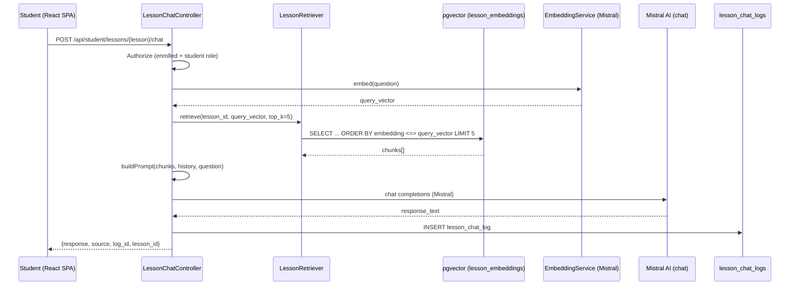
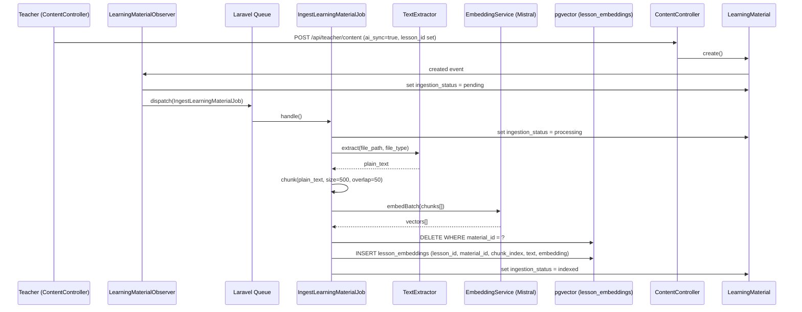

# Design Document: Lesson RAG Chat

## Overview

The Lesson RAG Chat feature adds a retrieval-augmented generation (RAG) chatbot scoped strictly to individual lesson pages. Students interact with a chatbot that answers questions using only the learning materials their teacher has uploaded for that specific lesson, yielding grounded, curriculum-relevant responses.

This is architecturally separate from the existing global chatbot (`ChatbotController` / `chatbot_logs`). The two systems share only the Mistral AI HTTP client and the authenticated user infrastructure — they do not share tables, service classes, conversation history, or retrieval logic.

### Content Hierarchy

```
Subject → Quarter → Topic → Lesson → LearningMaterial
```

A `LearningMaterial` is associated with a lesson via `lesson_id` on the `learning_materials` table. The RAG pipeline retrieves chunks keyed exclusively to that `lesson_id`.

---

## Architecture

### High-Level Flow



### Ingestion Flow



### Component Responsibilities

| Component | Responsibility |
|---|---|
| `LessonChatController` | HTTP layer — validate, authorize, orchestrate |
| `LessonChatLogController` | Teacher-facing log retrieval with pagination |
| `LessonRetriever` | Embed query, run pgvector similarity search, return top-K chunks |
| `RagPromptBuilder` | Assemble system prompt from chunks + history |
| `IngestLearningMaterialJob` | Extract → chunk → embed → upsert |
| `TextExtractor` | Delegate to file-type-specific parsers |
| `EmbeddingService` | Wrap Mistral AI embeddings endpoint |
| `LearningMaterialObserver` | Trigger jobs on model events |

---

## Components and Interfaces

### 1. `LessonChatController`

**Namespace:** `App\Http\Controllers\Api\Student`

**Route:** `POST /api/student/lessons/{lesson}/chat`

```php
class LessonChatController extends Controller
{
    public function ask(Request $request, Lesson $lesson): JsonResponse
    // Validates question (required, string, max:2000)
    // Checks student enrollment via $lesson->topic->schoolClass->students
    // Calls LessonRetriever::retrieve()
    // Calls RagPromptBuilder::build()
    // Calls Mistral AI HTTP
    // Persists LessonChatLog
    // Returns {response, source, log_id, lesson_id}
}
```

**Authorization:** Sanctum (`auth:sanctum`) + `student` role middleware. Returns 403 if the authenticated user is not enrolled in the class to which the lesson belongs. Returns 404 if the lesson does not exist (Laravel model binding handles this).

### 2. `LessonChatLogController`

**Namespace:** `App\Http\Controllers\Api\Teacher`

**Route:** `GET /api/teacher/lessons/{lesson}/chat-logs`

```php
class LessonChatLogController extends Controller
{
    public function index(Request $request, Lesson $lesson): JsonResponse
    // Verifies teacher owns the class containing this lesson
    // Returns paginated (20/page) lesson_chat_logs ordered by created_at DESC
    // Fields: id, student_id, question, response, source,
    //         retrieved_chunk_count, confidence_score, created_at
}
```

### 3. `LessonRetriever`

**Namespace:** `App\Services\Rag`

```php
class LessonRetriever
{
    public function retrieve(int $lessonId, array $queryVector, int $topK = 5): Collection
    // SELECT id, lesson_id, material_id, chunk_index, chunk_text,
    //        1 - (embedding <=> '[...]') AS score
    // FROM lesson_embeddings
    // WHERE lesson_id = :lessonId
    //   AND 1 - (embedding <=> '[...]') >= 0.5
    // ORDER BY embedding <=> '[...]' ASC, id ASC   ← tie-break by id
    // LIMIT :topK
}
```

Returns a `Collection` of objects with: `id`, `chunk_text`, `score`.

If the result set is empty (no chunks with score ≥ 0.5), returns an empty collection — the caller treats this as the "general knowledge" path.

### 4. `RagPromptBuilder`

**Namespace:** `App\Services\Rag`

```php
class RagPromptBuilder
{
    public function build(Collection $chunks, Collection $history, string $question): array
    // Returns the full messages array for Mistral, structured as:
    // [system_message, ...history_pairs, user_message]
}
```

System prompt variants:
- **With chunks:** Instructs the AI to answer from the provided lesson material context. Embeds chunk texts inline.
- **Without chunks:** Instructs the AI to use general knowledge and includes the notice: `"No indexed lesson materials are available for this lesson. Answering from general knowledge."`

### 5. `EmbeddingService`

**Namespace:** `App\Services\Rag`

```php
class EmbeddingService
{
    public function embed(string $text): array       // single vector
    public function embedBatch(array $texts): array  // list of vectors, same order
}
```

Calls `https://api.mistral.ai/v1/embeddings` with model `mistral-embed`. Returns float arrays. Throws `EmbeddingException` on non-2xx or timeout.

### 6. `TextExtractor`

**Namespace:** `App\Services\Rag`

```php
class TextExtractor
{
    public function extract(string $filePath, string $fileType): string
    // Delegates to:
    //   PDF  → smalot/pdfparser
    //   DOCX → phpoffice/phpword
    //   PPTX → phpoffice/phppresentation
    // Throws TextExtractionException on failure
}
```

### 7. `TextChunker`

**Namespace:** `App\Services\Rag`

```php
class TextChunker
{
    public function chunk(string $text, int $maxTokens = 500, int $overlap = 50): array
    // Returns array of string chunks
    // Token approximation: 1 token ≈ 4 characters (fast, good enough for chunking)
    // Splits on whitespace boundaries to avoid cutting mid-word
}
```

### 8. `LearningMaterialObserver`

**Namespace:** `App\Observers`

Registered in `AppServiceProvider`. Listens to:

| Event | Condition | Action |
|---|---|---|
| `created` | `ai_sync = true` AND `lesson_id != null` | Set `ingestion_status = pending`, dispatch `IngestLearningMaterialJob` |
| `updated` | `ai_sync` changed from false→true OR `file_path` changed AND `ai_sync = true` | Set `ingestion_status = pending`, dispatch `IngestLearningMaterialJob` |
| `updated` | `ai_sync` changed from true→false | Delete vector store entries, set `ingestion_status = none` |
| `deleted` | Always | Delete all `lesson_embeddings` rows for `material_id` |

### 9. `IngestLearningMaterialJob`

**Namespace:** `App\Jobs`

**Queue:** default (configurable). **Timeout:** 120s. **Tries:** 1 (does not auto-retry — failures are surfaced via `ingestion_status`).

```php
class IngestLearningMaterialJob implements ShouldQueue
{
    public function handle(
        TextExtractor $extractor,
        TextChunker $chunker,
        EmbeddingService $embedder
    ): void
}
```

Status lifecycle: `pending` → `processing` → `indexed` | `failed`.

---

## Data Models

### New Table: `lesson_embeddings`

Requires the `pgvector` extension on PostgreSQL.

```sql
CREATE EXTENSION IF NOT EXISTS vector;

CREATE TABLE lesson_embeddings (
    id            BIGSERIAL PRIMARY KEY,
    lesson_id     BIGINT NOT NULL REFERENCES lessons(id) ON DELETE CASCADE,
    material_id   BIGINT NOT NULL REFERENCES learning_materials(id) ON DELETE CASCADE,
    chunk_index   INTEGER NOT NULL,        -- 0-based position within the material
    chunk_text    TEXT NOT NULL,
    embedding     VECTOR(1024) NOT NULL,   -- Mistral embed dimension is 1024
    created_at    TIMESTAMP NOT NULL DEFAULT NOW(),

    INDEX idx_lesson_embeddings_lesson_id (lesson_id),
    INDEX idx_lesson_embeddings_material_id (material_id)
);

-- IVFFlat index for ANN search (create after bulk loading)
CREATE INDEX idx_lesson_embeddings_ivfflat
    ON lesson_embeddings
    USING ivfflat (embedding vector_cosine_ops)
    WITH (lists = 100);
```

**Migration file:** `create_lesson_embeddings_table`

### Modified Table: `learning_materials`

New column via migration:

```php
$table->enum('ingestion_status', ['none', 'pending', 'processing', 'indexed', 'failed'])
      ->default('none')
      ->after('ai_sync');
```

**Migration file:** `add_ingestion_status_to_learning_materials`

### New Table: `lesson_chat_logs`

```php
Schema::create('lesson_chat_logs', function (Blueprint $table) {
    $table->id();
    $table->foreignId('student_id')->constrained('users')->cascadeOnDelete();
    $table->foreignId('lesson_id')->constrained('lessons')->cascadeOnDelete();
    $table->text('question');
    $table->text('response');
    $table->string('source', 30);              // 'lesson_materials' | 'general'
    $table->unsignedTinyInteger('retrieved_chunk_count')->default(0);
    $table->unsignedTinyInteger('confidence_score');  // 90 or 70
    $table->timestamps();

    $table->index(['student_id', 'lesson_id', 'created_at']);
});
```

**Migration file:** `create_lesson_chat_logs_table`

### New Eloquent Models

**`LessonChatLog`** (`App\Models\LessonChatLog`):

```php
protected $fillable = [
    'student_id', 'lesson_id', 'question', 'response',
    'source', 'retrieved_chunk_count', 'confidence_score',
];

public function student(): BelongsTo { return $this->belongsTo(User::class, 'student_id'); }
public function lesson(): BelongsTo  { return $this->belongsTo(Lesson::class); }
```

**`LessonEmbedding`** (`App\Models\LessonEmbedding`):

```php
protected $fillable = [
    'lesson_id', 'material_id', 'chunk_index', 'chunk_text', 'embedding',
];

// Cast embedding to/from JSON array for pgvector driver compatibility
protected $casts = ['embedding' => 'array'];
```

### Updated `LearningMaterial` Model

Add to `$fillable`: `'ingestion_status'`, `'lesson_id'` (already present via migration).

Add observer registration in `AppServiceProvider::boot()`:

```php
LearningMaterial::observe(LearningMaterialObserver::class);
```

### Updated `Lesson` Model

Add relationship:

```php
public function learningMaterials(): HasMany
{
    return $this->hasMany(LearningMaterial::class);
}

public function topic(): BelongsTo
{
    return $this->belongsTo(Topic::class);
}
```

---

## Correctness Properties

*A property is a characteristic or behavior that should hold true across all valid executions of a system — essentially, a formal statement about what the system should do. Properties serve as the bridge between human-readable specifications and machine-verifiable correctness guarantees.*

### Property 1: Lesson-Scoped Retrieval Isolation

*For any* lesson ID `L` and any vector store seeded with chunks belonging to multiple distinct lesson IDs (including `L`), querying the retriever with lesson ID `L` shall return only chunks whose `lesson_id` equals `L`, and the returned set shall contain at most 5 chunks.

**Validates: Requirements 1.1, 1.4**

---

### Property 2: Retrieved Chunks Appear in System Prompt

*For any* non-empty list of retrieved chunks, the system prompt constructed by `RagPromptBuilder::build()` shall contain the text of every chunk in the input list.

**Validates: Requirements 1.2, 3.1**

---

### Property 3: Chunker Size and Overlap Invariants

*For any* input text of arbitrary length, the array of chunks produced by `TextChunker::chunk(text, maxTokens=500, overlap=50)` shall satisfy:
- Every chunk contains at most 500 tokens.
- For every pair of consecutive chunks `i` and `i+1`, the last 50 tokens of chunk `i` equal the first 50 tokens of chunk `i+1`.

**Validates: Requirements 2.3**

---

### Property 4: Embedding Count Matches Chunk Count

*For any* array of N text chunks passed to `EmbeddingService::embedBatch()`, the returned array of vectors shall have exactly N elements, preserving input order.

**Validates: Requirements 2.4**

---

### Property 5: Upsert Replaces Prior Embeddings

*For any* `material_id` that already has embeddings in `lesson_embeddings`, after `IngestLearningMaterialJob` completes successfully with a new set of chunks, the vector store shall contain exactly the new chunks for that `material_id` and zero rows matching the previous chunk set.

**Validates: Requirements 2.5**

---

### Property 6: Material Deletion Removes All Embeddings

*For any* `material_id` with one or more rows in `lesson_embeddings`, after the corresponding `LearningMaterial` is deleted, the count of `lesson_embeddings` rows with that `material_id` shall be 0.

**Validates: Requirements 2.7**

---

### Property 7: Source Field Assignment by Similarity Threshold

*For any* retrieval result set, if every chunk score is below 0.5 (or the result set is empty), the `source` field in the controller response shall be `"general"`. If at least one chunk with score ≥ 0.5 is present, `source` shall be `"lesson_materials"`.

**Validates: Requirements 3.3, 3.4**

---

### Property 8: Conversation History Window and Order

*For any* student + lesson combination with N existing `LessonChatLog` records, the message array assembled for the Mistral API shall include exactly `min(N, 5)` prior log pairs ordered by `created_at` ascending, followed by the current question as the last user message.

**Validates: Requirements 3.5**

---

### Property 9: Question Length Validation

*For any* string of length > 2000 characters submitted as `question`, the endpoint shall return HTTP 422. *For any* string of length 1–2000 characters, the endpoint shall not reject the request for length reasons.

**Validates: Requirements 3.7**

---

### Property 10: Response Payload Completeness

*For any* valid lesson chat request that produces a successful Mistral AI response, the JSON response body shall contain exactly the fields `response` (string), `source` (one of `"lesson_materials"` or `"general"`), `log_id` (integer), and `lesson_id` (integer).

**Validates: Requirements 4.4**

---

### Property 11: Chat Log Persistence with All Required Fields

*For any* successful lesson chat interaction, a `LessonChatLog` record shall be persisted in the database containing non-null values for `student_id`, `lesson_id`, `question`, `response`, `source`, `retrieved_chunk_count`, and `confidence_score`.

**Validates: Requirements 5.1**

---

### Property 12: Teacher Log List Includes Ingestion Status

*For any* list of `LearningMaterial` records returned by the teacher content endpoint, every item in the response payload shall include an `ingestion_status` field with a value from `{none, pending, processing, indexed, failed}`.

**Validates: Requirements 6.7**

---

### Property 13: Embedding Determinism

*For any* chunk text, embedding it twice using the same configured model version shall yield two vectors with cosine similarity ≥ 0.999.

**Validates: Requirements 8.1**

---

### Property 14: Retrieval Determinism and Tie-Breaking

*For any* query vector and unchanged vector store state, submitting the same query twice shall return the same ordered set of chunk IDs. When chunks have equal similarity scores, results shall be ordered by `id` ascending.

**Validates: Requirements 8.2, 8.3**

---

### Redundancy Analysis (Reflection)

After review:
- **1.1 and 1.4** → unified into Property 1 (isolation + limit)
- **1.2 and 3.1** → unified into Property 2 (prompt includes all chunks)
- **3.2** → subsumed by Property 1 (top-5 limit)
- **3.3 and 3.4** → unified into Property 7 (source field by threshold)
- **8.2 and 8.3** → unified into Property 14 (determinism + tie-break)
- **5.2 and 5.3** (confidence score rules) → constant rules, not universally quantifiable beyond their two discrete cases; tested as examples, not properties

No further redundancies identified. 14 properties remain, each providing unique validation value.

---

## Error Handling

### Mistral AI Errors

Both the embedding call and the chat completion call wrap the HTTP response:

```php
if ($response->failed()) {
    Log::error('Mistral API error', ['status' => $response->status()]);
    return response()->json(['error' => 'AI service temporarily unavailable. Please try again.'], 502);
}
```

Timeout is set to 30 seconds (matching the existing global chatbot). A `ConnectionException` is caught and returns 502.

### Ingestion Job Errors

`IngestLearningMaterialJob::handle()` wraps the entire body in a `try/catch`:

```php
try {
    $material->update(['ingestion_status' => 'processing']);
    $text = $this->extractor->extract($material->file_path, $material->file_type);
    // ... chunk → embed → upsert ...
    $material->update(['ingestion_status' => 'indexed']);
} catch (\Throwable $e) {
    Log::error('Ingestion failed', ['material_id' => $material->id, 'error' => $e->getMessage()]);
    $material->update(['ingestion_status' => 'failed']);
    // Do NOT rethrow — prevents queue retry and silent failure loops
}
```

The job sets `tries = 1` and does not implement `failed()` retry logic. Failure is surfaced to teachers via `ingestion_status = failed` in the materials list.

### Authorization Errors

- **Unauthenticated:** Laravel Sanctum returns 401 automatically.
- **Wrong role:** Role check middleware returns 403.
- **Not enrolled:** `LessonChatController` checks enrollment and returns 403 with `{"error": "You are not enrolled in the class for this lesson."}`.
- **Lesson not found:** Laravel model binding returns 404.
- **Teacher accessing another teacher's logs:** `LessonChatLogController` verifies `$lesson->topic->schoolClass->teacher_id === $request->user()->id`, otherwise returns 403.

### Vector Store Unavailability

If `pgvector` returns an error (extension missing, connection error), the exception propagates up through `LessonRetriever`, is caught in `LessonChatController`, and returns 502. The global chatbot is unaffected — it never touches `lesson_embeddings`.

---

## Testing Strategy

### New Dependencies Required

The following Composer packages must be added:

| Package | Purpose |
|---|---|
| `smalot/pdfparser` | PDF text extraction |
| `phpoffice/phpword` | DOCX text extraction |
| `phpoffice/phppresentation` | PPTX text extraction |

For property-based testing, use **[eris](https://github.com/giorgiosironi/eris)** (`giorgiosironi/eris`), a PHP property-based testing library that integrates with PHPUnit (already in the project).

### Unit Tests

Focus on specific examples, error paths, and edge cases that properties do not cover:

- `TextChunkerTest`: Short text (< 500 tokens, single chunk), empty string.
- `RagPromptBuilderTest`: Empty chunks produce "no indexed materials" notice; non-empty chunks include all texts.
- `TextExtractorTest`: One test per file type (PDF, DOCX, PPTX) with fixture files.
- `IngestLearningMaterialJobTest`:
  - Extraction failure → `ingestion_status = failed`, no rethrow.
  - Embedding failure → `ingestion_status = failed`, no rethrow.
  - Success → `ingestion_status = indexed`.
  - Status lifecycle: `pending → processing → indexed`.
- `LearningMaterialObserverTest`:
  - Create with `ai_sync=true` + `lesson_id` → job dispatched, status = `pending`.
  - Update `ai_sync` false→true → job dispatched.
  - Update `ai_sync` true→false → embeddings deleted, status = `none`.
  - Delete material → embeddings deleted.
- `LessonChatControllerTest`:
  - Unauthenticated → 401.
  - Teacher token → 403.
  - Student not enrolled → 403.
  - Lesson not found → 404.
  - Mistral 500 → 502.
  - Mistral timeout → 502.
  - `source = 'lesson_materials'` → `confidence_score = 90`.
  - `source = 'general'` → `confidence_score = 70`.
- `LessonChatLogControllerTest`:
  - Teacher for wrong class → 403.
  - Student accessing another student's logs → 403.
  - Pagination returns ≤ 20 per page, sorted by `created_at` DESC.

### Property-Based Tests

Each test runs a minimum of **100 iterations**. Tests are tagged with a comment referencing the design property.

```php
// Feature: lesson-rag-chat, Property 1: Lesson-Scoped Retrieval Isolation
// Feature: lesson-rag-chat, Property 3: Chunker Size and Overlap Invariants
// ... etc.
```

| Property | Test class | What is generated |
|---|---|---|
| Property 1 | `LessonRetrieverPropertyTest` | Random lesson IDs + chunk seeds across multiple lessons |
| Property 2 | `RagPromptBuilderPropertyTest` | Random non-empty chunk text arrays |
| Property 3 | `TextChunkerPropertyTest` | Random text strings of varying lengths (1 – 100,000 chars) |
| Property 4 | `EmbeddingServicePropertyTest` | Random arrays of 1–50 chunk texts (mocked HTTP) |
| Property 5 | `IngestJobUpsertPropertyTest` | Random material IDs + chunk arrays (in-memory SQLite) |
| Property 6 | `MaterialDeletionPropertyTest` | Random materials with seeded embeddings |
| Property 7 | `SourceFieldPropertyTest` | Random score arrays above/below 0.5 threshold |
| Property 8 | `ConversationHistoryPropertyTest` | Random N log records (0–20) |
| Property 9 | `QuestionLengthPropertyTest` | Random strings of lengths 1–3000 |
| Property 10 | `ResponsePayloadPropertyTest` | Random valid question inputs (mocked AI) |
| Property 11 | `ChatLogPersistencePropertyTest` | Random valid question inputs (mocked AI) |
| Property 12 | `MaterialListPayloadPropertyTest` | Random N materials with varying ingestion_status |
| Property 13 | `EmbeddingDeterminismPropertyTest` | Random text inputs (mocked deterministic embedder) |
| Property 14 | `RetrieverDeterminismPropertyTest` | Random query vectors + seeded vector store states |

### Integration Tests

Run against a real PostgreSQL instance with pgvector installed (CI database service):

- Full ingestion pipeline: upload fixture PDF → job runs → embeddings present in `lesson_embeddings`.
- Full chat pipeline: seeded embeddings → student query → response with `source = 'lesson_materials'`.
- Global chatbot isolation: call `POST /api/student/chatbot/ask` with pgvector present; assert `lesson_embeddings` table is never queried.
