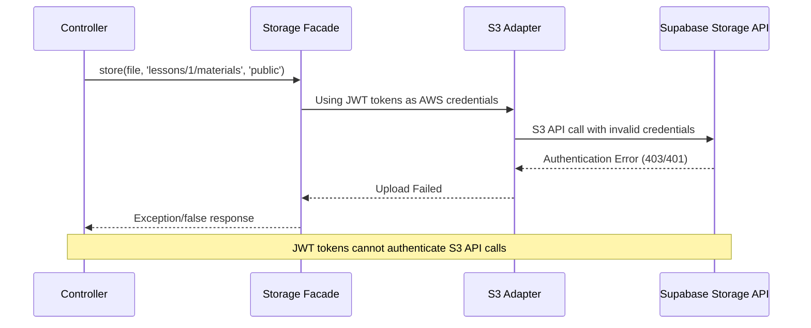
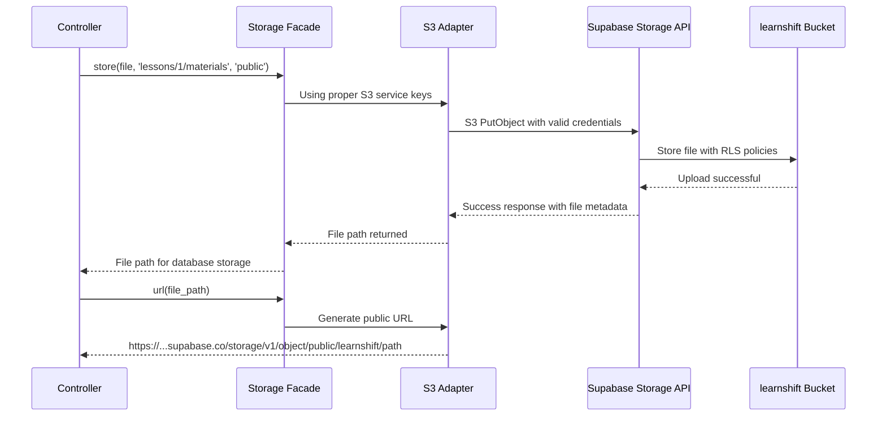

# Design Document: Supabase Storage Integration Fix

## Overview

This bugfix addresses critical authentication and configuration issues in the Laravel application's Supabase storage integration. The current implementation incorrectly uses JWT tokens (anon and service_role) as AWS S3 credentials, preventing proper file uploads and access to the Supabase storage bucket. The fix involves replacing JWT tokens with proper S3-compatible service keys, implementing robust error handling, ensuring consistent file URL generation, and verifying bucket permissions.

The root cause is a fundamental misunderstanding of Supabase storage authentication. Supabase storage provides an S3-compatible API that requires dedicated S3 service keys, not JWT tokens used for database access. This affects file uploads in ContentController and TopicController, file processing in IngestLearningMaterialJob, and file URL generation across the application.

## Architecture

```mermaid
graph TD
    A[Laravel Application] --> B[Storage Facade]
    B --> C[S3 Driver Configuration]
    C --> D[Supabase S3-Compatible API]
    D --> E[learnshift Bucket]
    
    F[ContentController] --> B
    G[TopicController] --> B
    H[IngestLearningMaterialJob] --> B
    
    I[.env Configuration] --> C
    J[Supabase Service Keys] --> I
    
    K[Error Handling] --> F
    K --> G
    K --> H
    
    L[File URL Generation] --> M[Storage::disk('public')->url()]
    M --> N[Public File URLs]
    
    style D fill:#ff9999
    style J fill:#99ff99
    style K fill:#99ccff
```

## Sequence Diagrams

### Current Problematic Flow



### Fixed Flow



## Components and Interfaces

### Component 1: Storage Configuration Manager

**Purpose**: Manages Supabase S3-compatible storage configuration with proper authentication

**Interface**:
```php
interface SupabaseStorageConfigInterface
{
    public function getS3ServiceKey(): string;
    public function getS3SecretKey(): string;
    public function validateConfiguration(): bool;
    public function getBucketName(): string;
    public function getEndpointUrl(): string;
    public function getPublicUrlBase(): string;
}
```

**Responsibilities**:
- Validate S3 service key format (not JWT tokens)
- Provide proper credentials for S3 API calls
- Generate correct endpoint URLs
- Validate bucket access permissions

### Component 2: Enhanced File Upload Handler

**Purpose**: Handles file uploads with proper error handling and logging

**Interface**:
```php
interface FileUploadHandlerInterface
{
    public function uploadFile(UploadedFile $file, string $path, string $disk = 'public'): UploadResult;
    public function validateFile(UploadedFile $file): ValidationResult;
    public function generateFilePath(int $lessonId, string $originalName): string;
    public function handleUploadError(\Throwable $exception): ErrorResponse;
}

class UploadResult
{
    public function __construct(
        public readonly bool $success,
        public readonly ?string $filePath,
        public readonly ?string $fileUrl,
        public readonly ?string $errorMessage
    ) {}
}
```

**Responsibilities**:
- Execute file uploads with comprehensive error handling
- Generate consistent file paths following lessons/{lesson_id}/materials/ pattern
- Provide detailed error messages for debugging
- Return structured upload results

### Component 3: File URL Generator

**Purpose**: Provides consistent file URL generation across controllers

**Interface**:
```php
interface FileUrlGeneratorInterface
{
    public function generatePublicUrl(string $filePath): string;
    public function isUrlAccessible(string $url): bool;
    public function generateSignedUrl(string $filePath, int $expiresInSeconds = 3600): string;
}
```

**Responsibilities**:
- Generate consistent public URLs for stored files
- Validate URL accessibility
- Handle both public and private file access patterns

## Data Models

### Configuration Model

```php
class StorageConfiguration
{
    public string $accessKeyId;
    public string $secretAccessKey;
    public string $region;
    public string $bucket;
    public string $endpoint;
    public string $publicUrlBase;
    public bool $usePathStyleEndpoint;
    
    public function isValid(): bool;
    public function getCredentialType(): string; // 'jwt' | 's3_key'
}
```

**Validation Rules**:
- Access key must not be a JWT token (no dots in key)
- Secret key must not be a JWT token (no dots in key)
- Endpoint must be valid Supabase storage URL
- Bucket name must match Supabase project configuration

### Enhanced LearningMaterial Model

```php
class LearningMaterial extends Model
{
    // Existing fields...
    
    public function getFileUrlAttribute(): ?string;
    public function getPublicUrlAttribute(): ?string;
    public function isFileAccessible(): bool;
    public function getStorageMetadata(): array;
}
```

## Algorithmic Pseudocode

### Main File Upload Algorithm

```php
ALGORITHM processFileUpload(UploadedFile $file, int $lessonId, string $title)
INPUT: file (uploaded file object), lessonId (integer), title (string)
OUTPUT: LearningMaterial model or exception

BEGIN
  ASSERT file.isValid() = true
  ASSERT lessonId > 0
  
  // Step 1: Validate file and generate path
  validationResult ← validateFile(file)
  IF validationResult.isValid = false THEN
    THROW ValidationException(validationResult.errors)
  END IF
  
  filePath ← generateFilePath(lessonId, file.getClientOriginalName())
  
  // Step 2: Upload file with error handling
  TRY
    storagePath ← Storage::disk('public')->store(filePath, file)
    IF storagePath = false OR storagePath = null THEN
      THROW StorageException("Upload returned invalid path")
    END IF
    
    // Step 3: Verify upload success and generate URL
    fileExists ← Storage::disk('public')->exists(storagePath)
    IF fileExists = false THEN
      THROW StorageException("File upload verification failed")
    END IF
    
    publicUrl ← Storage::disk('public')->url(storagePath)
    
    // Step 4: Test URL accessibility
    urlAccessible ← testUrlAccessibility(publicUrl)
    IF urlAccessible = false THEN
      LOG_WARNING("File uploaded but URL not accessible: " + publicUrl)
    END IF
    
  CATCH StorageException e THEN
    LOG_ERROR("Storage operation failed", {error: e.getMessage(), trace: e.getTraceAsString()})
    THROW new FileUploadException("Upload failed: " + e.getMessage())
  END CATCH
  
  // Step 5: Create database record
  material ← LearningMaterial::create({
    teacher_id: user.id,
    lesson_id: lessonId,
    title: title,
    file_path: storagePath,
    file_name: file.getClientOriginalName(),
    file_type: file.getClientOriginalExtension().toUpper(),
    file_size: file.getSize(),
    ingestion_status: 'pending'
  })
  
  ASSERT material.id IS NOT NULL
  
  RETURN material
END
```

**Preconditions:**
- File is a valid UploadedFile instance
- User has permission to upload to the specified lesson
- Storage disk is properly configured with valid credentials
- Lesson exists and belongs to the authenticated user

**Postconditions:**
- File is successfully uploaded to Supabase storage
- Database record is created with correct metadata
- File URL is publicly accessible (or warning logged)
- Upload path follows lessons/{lesson_id}/materials/ pattern

**Loop Invariants:** N/A (no loops in this algorithm)

### Storage Configuration Validation Algorithm

```php
ALGORITHM validateStorageConfiguration(array $config)
INPUT: config (array of storage configuration)
OUTPUT: ValidationResult with success status and error details

BEGIN
  errors ← []
  
  // Step 1: Validate credentials are not JWT tokens
  accessKey ← config['key']
  secretKey ← config['secret']
  
  IF containsDots(accessKey) OR containsDots(secretKey) THEN
    errors.append("Credentials appear to be JWT tokens, not S3 keys")
  END IF
  
  IF length(accessKey) < 16 OR length(secretKey) < 32 THEN
    errors.append("Credentials too short for valid S3 keys")
  END IF
  
  // Step 2: Validate endpoint format
  endpoint ← config['endpoint']
  IF NOT isValidUrl(endpoint) THEN
    errors.append("Invalid endpoint URL format")
  END IF
  
  IF NOT contains(endpoint, "supabase.co/storage/v1/s3") THEN
    errors.append("Endpoint does not match Supabase storage pattern")
  END IF
  
  // Step 3: Validate bucket configuration
  bucket ← config['bucket']
  IF isEmpty(bucket) THEN
    errors.append("Bucket name is required")
  END IF
  
  // Step 4: Test connection if basic validation passes
  IF isEmpty(errors) THEN
    TRY
      connectionTest ← testStorageConnection(config)
      IF connectionTest.success = false THEN
        errors.append("Storage connection test failed: " + connectionTest.error)
      END IF
    CATCH Exception e THEN
      errors.append("Connection test exception: " + e.getMessage())
    END CATCH
  END IF
  
  RETURN ValidationResult(isEmpty(errors), errors)
END
```

**Preconditions:**
- Configuration array contains required keys: 'key', 'secret', 'endpoint', 'bucket'
- Network connectivity is available for connection testing

**Postconditions:**
- Returns validation result indicating whether configuration is valid
- If invalid, provides specific error messages for debugging
- Connection test is performed only if basic validation passes

**Loop Invariants:**
- All validation errors are collected before returning result
- No partial validation state is returned

## Key Functions with Formal Specifications

### Function 1: generateConsistentFileUrl()

```php
function generateConsistentFileUrl(string $filePath, string $disk = 'public'): string
```

**Preconditions:**
- `$filePath` is non-empty and represents a valid storage path
- `$disk` is a configured Laravel storage disk name
- File exists at the specified path

**Postconditions:**
- Returns a valid HTTPS URL pointing to the file
- URL follows Supabase public storage pattern
- URL is immediately accessible (no caching delays)
- Consistent URL format across all controllers

**Loop Invariants:** N/A (no loops in function)

### Function 2: handleStorageException()

```php
function handleStorageException(\Throwable $exception, array $context = []): ErrorResponse
```

**Preconditions:**
- `$exception` is a valid Throwable instance
- `$context` array contains relevant debugging information
- Logger is properly configured

**Postconditions:**
- Exception details are logged with appropriate level
- User-friendly error message is returned
- Sensitive information (credentials) is not exposed
- Context information is preserved for debugging

**Loop Invariants:** N/A (no loops in function)

### Function 3: verifyBucketAccess()

```php
function verifyBucketAccess(string $bucketName, array $credentials): BucketAccessResult
```

**Preconditions:**
- `$bucketName` is a valid, non-empty bucket name
- `$credentials` array contains valid S3-compatible access keys
- Network connectivity is available

**Postconditions:**
- Returns structured result indicating access permissions
- Tests both read and write permissions
- Identifies specific permission issues if access fails
- No side effects on bucket contents during testing

**Loop Invariants:**
- Permission tests are performed in order: existence, read, write
- Testing stops at first failure to minimize API calls

## Example Usage

### Example 1: Fixed File Upload in ContentController

```php
// Fixed implementation with proper error handling
public function store(Request $request)
{
    $request->validate([
        'title'      => 'required|string|max:255',
        'lesson_id'  => 'required|exists:lessons,id',
        'file'       => 'required|file|mimes:pdf,docx,pptx,doc,ppt,txt|max:51200',
    ]);

    // Verify ownership (existing code)
    $lesson = $this->verifyLessonOwnership($request->lesson_id, $request->user()->id);
    if (!$lesson) {
        return response()->json(['message' => 'Lesson not found or unauthorized.'], 403);
    }

    $file = $request->file('file');
    
    try {
        // Use consistent file path generation
        $filePath = "lessons/{$request->lesson_id}/materials/" . 
                   Str::uuid() . '.' . $file->getClientOriginalExtension();
        
        // Upload with comprehensive error handling
        $storagePath = Storage::disk('public')->putFileAs(
            dirname($filePath), 
            $file, 
            basename($filePath)
        );
        
        if (!$storagePath) {
            throw new \RuntimeException('Storage operation returned false');
        }
        
        // Verify upload success
        if (!Storage::disk('public')->exists($storagePath)) {
            throw new \RuntimeException('File upload verification failed');
        }
        
        // Generate and test URL
        $fileUrl = Storage::disk('public')->url($storagePath);
        Log::info('File uploaded successfully', [
            'path' => $storagePath, 
            'url' => $fileUrl,
            'filename' => $file->getClientOriginalName()
        ]);
        
        // Test URL accessibility (async or with timeout)
        $this->verifyUrlAccessibility($fileUrl);
        
    } catch (\Exception $e) {
        Log::error('File upload failed', [
            'lesson_id' => $request->lesson_id,
            'filename' => $file->getClientOriginalName(),
            'error' => $e->getMessage(),
            'trace' => $e->getTraceAsString()
        ]);
        
        return response()->json([
            'message' => 'Failed to upload file',
            'error' => $e->getMessage(),
            'debug' => config('app.debug') ? $e->getTraceAsString() : null
        ], 500);
    }

    $material = LearningMaterial::create([
        'teacher_id'       => $request->user()->id,
        'lesson_id'        => $request->lesson_id,
        'title'            => $request->title,
        'file_path'        => $storagePath,
        'file_name'        => $file->getClientOriginalName(),
        'file_type'        => strtoupper($file->getClientOriginalExtension()),
        'file_size'        => $file->getSize(),
        'ingestion_status' => 'pending',
    ]);

    return response()->json([
        'success' => true,
        'material' => $material,
        'file_url' => $fileUrl
    ], 201);
}
```

### Example 2: Configuration Validation

```php
// Environment configuration validation
public function validateSupabaseConfig(): array
{
    $config = [
        'access_key' => env('AWS_ACCESS_KEY_ID'),
        'secret_key' => env('AWS_SECRET_ACCESS_KEY'),
        'endpoint' => env('AWS_ENDPOINT'),
        'bucket' => env('AWS_BUCKET'),
    ];
    
    $errors = [];
    
    // Check for JWT token patterns (contain dots)
    if (str_contains($config['access_key'], '.') || str_contains($config['secret_key'], '.')) {
        $errors[] = 'Credentials appear to be JWT tokens, not S3 service keys';
    }
    
    // Validate endpoint format
    $expectedPattern = 'https://*.supabase.co/storage/v1/s3';
    if (!preg_match('#https://[^.]+\.supabase\.co/storage/v1/s3#', $config['endpoint'])) {
        $errors[] = 'Endpoint does not match expected Supabase storage pattern';
    }
    
    return [
        'valid' => empty($errors),
        'errors' => $errors,
        'config' => $config
    ];
}
```

### Example 3: Consistent URL Generation

```php
// Enhanced LearningMaterial model methods
class LearningMaterial extends Model
{
    // ... existing code ...
    
    public function getFileUrlAttribute(): ?string
    {
        if ($this->file_type === 'LINK') {
            return $this->file_path; // External URL
        }
        
        if (!$this->file_path) {
            return null;
        }
        
        try {
            return Storage::disk('public')->url($this->file_path);
        } catch (\Exception $e) {
            Log::error('Failed to generate file URL', [
                'material_id' => $this->id,
                'file_path' => $this->file_path,
                'error' => $e->getMessage()
            ]);
            return null;
        }
    }
    
    public function isFileAccessible(): bool
    {
        $url = $this->file_url;
        if (!$url) return false;
        
        try {
            $response = Http::timeout(10)->head($url);
            return $response->successful();
        } catch (\Exception $e) {
            Log::warning('File accessibility check failed', [
                'material_id' => $this->id,
                'url' => $url,
                'error' => $e->getMessage()
            ]);
            return false;
        }
    }
}
```

## Correctness Properties

*A property is a characteristic or behavior that should hold true across all valid executions of a system—essentially, a formal statement about what the system should do. Properties serve as the bridge between human-readable specifications and machine-verifiable correctness guarantees.*

### Property 1: Credential Validation

*For any* storage configuration, if credentials are provided, they must be valid S3 service keys and not JWT tokens (must not contain dot separators typical of JWT format).

### Property 2: Upload Path Consistency

*For any* file upload to a lesson, the storage path must follow the pattern `lessons/{lesson_id}/materials/{filename}` where lesson_id matches the target lesson and filename includes a unique identifier.

### Property 3: File Upload Success Verification

*For any* successful file upload operation, the file must exist at the returned storage path and be accessible via the generated public URL.

### Property 4: Error Handling Completeness

*For any* storage operation failure, the system must log the complete error context (operation type, file details, error message) and return a user-appropriate error response without exposing sensitive credentials.

### Property 5: URL Generation Consistency

*For any* stored file, calling `Storage::disk('public')->url($path)` multiple times must return the same URL format and the URL must be immediately accessible without caching delays.

### Property 6: Configuration Validation Completeness

*For any* storage configuration validation, all required fields (access key, secret key, endpoint, bucket) must be checked and specific error messages provided for each missing or invalid field.

## Error Handling

### Error Scenario 1: Invalid Credentials

**Condition**: JWT tokens used instead of S3 service keys
**Response**: Configuration validation fails with descriptive error message
**Recovery**: Update .env file with proper S3 service keys from Supabase dashboard

### Error Scenario 2: File Upload Failure

**Condition**: Network issues, permission problems, or storage quota exceeded
**Response**: Log complete error details, return user-friendly error message
**Recovery**: Retry upload, check bucket permissions, verify storage quota

### Error Scenario 3: URL Generation Failure

**Condition**: File exists but URL generation fails or returns inaccessible URL
**Response**: Log URL accessibility issue, return fallback or null URL
**Recovery**: Check bucket public access settings, verify RLS policies

### Error Scenario 4: Bucket Access Denied

**Condition**: Service keys lack necessary permissions for bucket operations
**Response**: Log permission error with specific operation that failed
**Recovery**: Update bucket policies or service key permissions in Supabase

## Testing Strategy

### Unit Testing Approach

Focus on individual component behavior with mocked dependencies:
- Configuration validation logic with various input combinations
- File path generation with different lesson IDs and filenames
- Error handling with simulated storage exceptions
- URL generation with mocked storage responses

### Property-Based Testing Approach

**Property Test Library**: Pest (PHP property testing framework)

Generate random inputs to verify universal properties:
- Credential validation with generated JWT-like and key-like strings
- File path consistency with random lesson IDs and filenames
- Error handling with various exception types and contexts
- URL generation with different file paths and storage configurations

### Integration Testing Approach

Test complete workflows with real Supabase storage:
- End-to-end file upload through ContentController and TopicController
- File processing workflow through IngestLearningMaterialJob
- URL accessibility testing with actual Supabase endpoints
- Configuration validation with real Supabase project settings

## Performance Considerations

- File upload timeout increased to handle large PPTX/DOCX files (5 minutes)
- URL accessibility testing performed asynchronously to avoid blocking uploads
- Batch processing for multiple file operations to minimize API calls
- Connection pooling for repeated storage operations within single request

## Security Considerations

- Service keys stored securely in environment variables, not in code
- No credential information exposed in error messages or logs
- File access controlled through Supabase RLS policies
- File upload validation to prevent malicious file types
- Path traversal protection in file path generation

## Dependencies

- Laravel Storage facade with S3 driver
- Supabase project with storage enabled and properly configured bucket
- S3-compatible service keys from Supabase dashboard (not JWT tokens)
- PHP HTTP client for URL accessibility testing
- Proper RLS policies configured on Supabase storage bucket